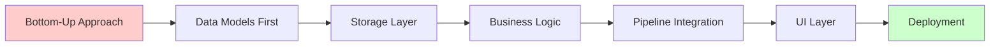
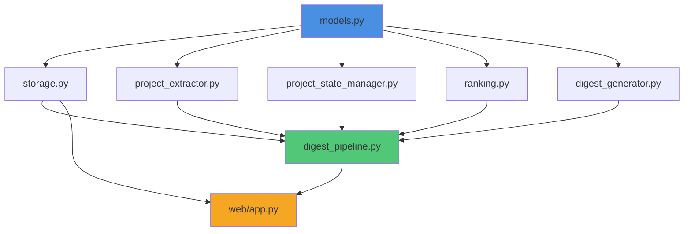

# Daily Digest - Implementation Flow

## Development Steps

```mermaid
graph TD
    Start([Start Project]) --> Step1[1. Define Data Models<br/>models.py]

    Step1 --> Entities["Created Dataclasses:<br/>• Message<br/>• Project<br/>• UserProjectState<br/>• DigestItem<br/>• ProjectGroup<br/>• Digest"]

    Entities --> Step2[2. Build Storage Layer<br/>storage.py]

    Step2 --> StorageOps["Implemented:<br/>• Load/save JSON files<br/>• Messages, projects, users<br/>• User states, digests"]

    StorageOps --> Step3[3. Generate Mock Data<br/>generate_mock_data.py]

    Step3 --> MockData["Created:<br/>• 3 projects<br/>• 10 users with roles<br/>• ~75 realistic messages<br/>• Initial user states"]

    MockData --> Step4[4. Project Extraction<br/>project_extractor.py]

    Step4 --> Extraction["Implemented:<br/>• Channel matching<br/>• Keyword detection<br/>• DM handling"]

    Extraction --> Step5[5. State Management<br/>project_state_manager.py]

    Step5 --> StateLogic["Implemented:<br/>• Phase detection (active/review/done)<br/>• State transitions<br/>• Activity counting<br/>• Anomaly detection"]

    StateLogic --> Step6[6. Relevance Ranking<br/>ranking.py]

    Step6 --> Scoring["Implemented:<br/>• Time decay calculation<br/>• Urgency/mention boosts<br/>• Phase-based adjustments<br/>• Activity boost"]

    Scoring --> Step7[7. Digest Generation<br/>digest_generator.py]

    Step7 --> DigestLogic["Implemented:<br/>• Message categorization<br/>• Project grouping<br/>• AI summary integration<br/>• Fallback summaries"]

    DigestLogic --> Step8[8. Main Pipeline<br/>digest_pipeline.py]

    Step8 --> Pipeline["Orchestrated:<br/>• Load data<br/>• Update states<br/>• Filter & rank<br/>• Generate digest<br/>• Save results"]

    Pipeline --> Step9[9. Web Interface<br/>web/app.py]

    Step9 --> WebUI["Created:<br/>• Flask routes<br/>• User selection page<br/>• Digest display page<br/>• Styling (CSS)"]

    WebUI --> Step10[10. Testing & Refinement<br/>test_pipeline.py]

    Step10 --> Testing["Tested:<br/>• Pipeline functionality<br/>• Different user scenarios<br/>• Edge cases"]

    Testing --> Step11[11. Deployment Setup]

    Step11 --> Deploy["Configured:<br/>• requirements.txt<br/>• Procfile<br/>• render.yaml<br/>• .gitignore"]

    Deploy --> Step12[12. GitHub & Hosting]

    Step12 --> Final["Completed:<br/>• Pushed to GitHub<br/>• Deployed to Render<br/>• Added OpenAI integration"]

    Final --> End([Live Application])

    style Start fill:#e1f5e1
    style End fill:#e1f5e1
    style Step1 fill:#cce5ff
    style Step2 fill:#cce5ff
    style Step3 fill:#cce5ff
    style Step4 fill:#cce5ff
    style Step5 fill:#cce5ff
    style Step6 fill:#cce5ff
    style Step7 fill:#cce5ff
    style Step8 fill:#cce5ff
    style Step9 fill:#cce5ff
    style Step10 fill:#cce5ff
    style Step11 fill:#ffe5cc
    style Step12 fill:#ffe5cc
```

## File Creation Order

1. **src/models.py** - Data structures
2. **src/storage.py** - JSON persistence
3. **src/generate_mock_data.py** - Test data
4. **src/project_extractor.py** - Project identification
5. **src/project_state_manager.py** - Phase management
6. **src/ranking.py** - Relevance scoring
7. **src/digest_generator.py** - Digest creation with AI
8. **src/digest_pipeline.py** - Main orchestration
9. **web/app.py** - Flask web server
10. **web/templates/*.html** - UI pages
11. **web/static/style.css** - Styling
12. **test_pipeline.py** - Testing script
13. **run_web_ui.py** - Convenience launcher
14. **requirements.txt** - Dependencies
15. **Procfile** - Deployment config
16. **render.yaml** - Render config
17. **.gitignore** - Git exclusions

## Key Implementation Decisions

## Component Dependencies

